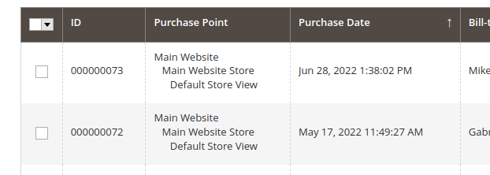

# Tezus ForceSalesGridDateDesc

## Funcionalidades

Módulo para forçar a ordem do grid das vendas para exibir as últimas vendas primeiro.

## Compatibilidade
- [x] Magento 2.4.x

## Instalação

- Clone o repositório a partir do seguinte [Link](https://github.com/tezusecommerce/ForceSalesGridDateDesc)
- Na raiz do magento, dentro da pasta App > Code > Crie a pasta Tezus. Ficará da seguinte maneira `app/code/Tezus`.
- Aplique as atualizações do banco de dados: `php bin/magento setup:upgrade`
- Limpe o Cache `php bin/magento cache:clean && bin/magento cache:flush`

## Configurações

O módulo não possui configurações. Após instalado ele já estará em funcionamento normal.

